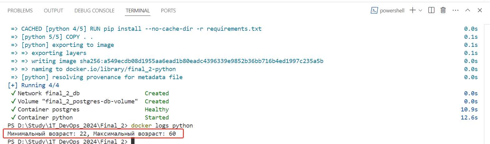

# Итоговая аттестация по второму модулю курса "Архитектор данных"

## Для запуска выполнить следующие команды:  
### 1. Наберите в терминале "***git clone https://github.com/mazavlia/final2.git***"
### 2. В директории, куда склонировали проект, введите "***docker compose up -d***"

## Результат выполнениия:
